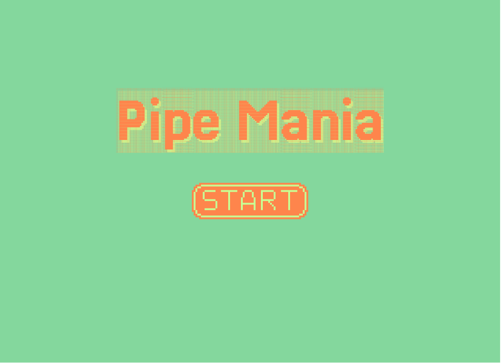
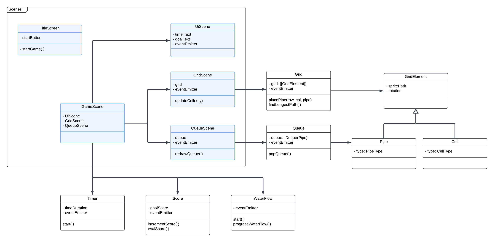

# PipeMania Clone
**`By Paulina Wykowska`**


This is a clone of the classical grid-based game PipeMania, developed with `HTML` and `JavaScript`, using the `Phaser` framework.



### Features
- A browser-based game inspired by the classic PipeMania.
- Powered by Phaser 3 for 2D game development.
- Uses Vite for fast builds and development.

---

## How to install

### Prerequisites
Make sure you have the following installed:
- [Node.js](https://nodejs.org)
- [npm](https://www.npmjs.com/)

### Installation

1. Open the project
```
cd pipemania
```

2. Install dependencies
```
npm install
```

### Run & Build
Use this command to run the project in development mode. 
```
npm run start
```
Open your browser and navigate to http://localhost:5173 (default Vite dev server address).

You can create a build, which will be saved in a `/dist` folder.
```
npm run build
```

---

## How to play
Use mouse pointer to place the pipes, and create the longest pipe path possible!

In this version, the game consists of only one level, at the end of which either a Victory or a Loss is achieved.
The game can be reloaded by refreshing the page.

---

## About the project
The project was implemented from scratch, and the assets were made by me as well.

For the queue of pipes, a Double-Ended Queue (deque) data structure was used. Deque allows for O(1) insertions and removals at either end of the queue, by maintaining a `prev` and a `next` node for each element.

The path-finding algorithm for the water flow is an adaptation of Depth-First Search (DFS). This algorithm is called periodically, as the cells are filled with water, to determine which will be the next cell to be filled. For example, if it takes 1 second to fill a cell, then this function is called once every second. It creates a matrix of distances where, for each cell, it stores the length of the longest path that can be originated from it. When determining the next cell to be filled with water, the one with largest length is chosen. More pipes can be added to the path dynamically, until a flow-ending condition is met. If the path reaches a dead end, then the Water Flow Progression process will be considered complete.

The communication between different entities is done mostly through events. The file `/src/objects/events.js` contains all the events that are used.
The exceptions are the `GridScene`, which creates its own `Grid` instance, and `QueueScene`, which creates its own `Queue` instance. These instances are iterated through by the Scenes, in order to retrieve the Pipe/Cell elements, and draw them. In case of `GridScene`, it also asks `Grid` if a given cell is valid for placing a pipe. 

Below is a simplified UML diagram of the project.

